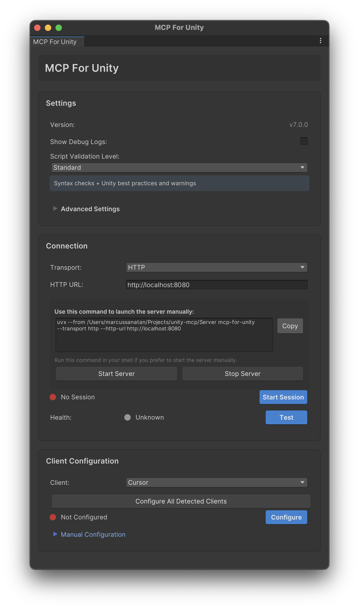

| [English](README.md) | [简体中文](README-zh.md) |
|----------------------|---------------------------------|

#### Proudly sponsored and maintained by [Coplay](https://www.coplay.dev/?ref=unity-mcp) -- the best AI assistant for Unity.

[](https://discord.gg/y4p8KfzrN4)
[](https://www.coplay.dev/?ref=unity-mcp)
[](https://unity.com/releases/editor/archive)
[](https://www.python.org)
[](https://modelcontextprotocol.io/introduction)


[](https://opensource.org/licenses/MIT)

**Create your Unity apps with LLMs!**

MCP for Unity acts as a bridge, allowing AI assistants (like Claude, Cursor) to interact directly with your Unity Editor via a local **MCP (Model Context Protocol) Client**. Give your LLM tools to manage assets, control scenes, edit scripts, and automate tasks within Unity.



---

### 💬 Join Our [Discord](https://discord.gg/y4p8KfzrN4)

**Get help, share ideas, and collaborate with other MCP for Unity developers!**  

---

## Key Features 🚀

* **🗣️ Natural Language Control:** Instruct your LLM to perform Unity tasks.
* **🛠️ Powerful Tools:** Manage assets, scenes, materials, scripts, and editor functions.
* **🤖 Automation:** Automate repetitive Unity workflows.
* **🧩 Extensible:** Designed to work with various MCP Clients.

<details open>
  <summary><strong>Tools</strong></summary>

  Your LLM can use functions like:

* `execute_menu_item`: Executes Unity Editor menu items (e.g., "File/Save Project").
* `manage_asset`: Performs asset operations (import, create, modify, delete, etc.).
* `manage_editor`: Controls and queries the editor's state and settings.
* `manage_gameobject`: Manages GameObjects: create, modify, delete, find, and component operations.
* `manage_prefabs`: Performs prefab operations (create, modify, delete, etc.).
* `manage_scene`: Manages scenes (load, save, create, get hierarchy, etc.).
* `manage_script`: Compatibility router for legacy script operations (create, read, delete). Prefer `apply_text_edits` or `script_apply_edits` for edits.
* `manage_shader`: Performs shader CRUD operations (create, read, modify, delete).
* `read_console`: Gets messages from or clears the console.
* `run_tests`: Runs tests in the Unity Editor.
* `set_active_instance`: Routes subsequent tool calls to a specific Unity instance (when multiple are running).
* `apply_text_edits`: Precise text edits with precondition hashes and atomic multi-edit batches.
* `script_apply_edits`: Structured C# method/class edits (insert/replace/delete) with safer boundaries.
* `validate_script`: Fast validation (basic/standard) to catch syntax/structure issues before/after writes.
* `create_script`: Create a new C# script at the given project path.
* `delete_script`: Delete a C# script by URI or Assets-relative path.
* `get_sha`: Get SHA256 and basic metadata for a Unity C# script without returning file contents.
</details>


<details open>
  <summary><strong>Resources</strong></summary>

  Your LLM can retrieve the following resources:

* `unity_instances`: Lists all running Unity Editor instances with their details (name, path, port, status).
* `menu_items`: Retrieves all available menu items in the Unity Editor.
* `tests`: Retrieves all available tests in the Unity Editor. Can select tests of a specific type (e.g., "EditMode", "PlayMode").
* `editor_active_tool`: Currently active editor tool (Move, Rotate, Scale, etc.) and transform handle settings.
* `editor_prefab_stage`: Current prefab editing context if a prefab is open in isolation mode.
* `editor_selection`: Detailed information about currently selected objects in the editor.
* `editor_state`: Current editor runtime state including play mode, compilation status, active scene, and selection summary.
* `editor_windows`: All currently open editor windows with their titles, types, positions, and focus state.
* `project_info`: Static project information including root path, Unity version, and platform.
* `project_layers`: All layers defined in the project's TagManager with their indices (0-31).
* `project_tags`: All tags defined in the project's TagManager.
</details>
---

## How It Works 

MCP for Unity connects your tools using two components:

1. **MCP for Unity Bridge:** A Unity package running inside the Editor. (Installed via Package Manager).
2. **MCP for Unity Server:** A Python server that runs locally, communicating between the Unity Bridge and your MCP Client. (Installed automatically by the package on first run or via Auto-Setup; manual setup is available as a fallback).


---

## Installation ⚙️

### Prerequisites

  * **Python:** Version 3.10 or newer. [Download Python](https://www.python.org/downloads/)
  * **Unity Hub & Editor:** Version 2021.3 LTS or newer. [Download Unity](https://unity.com/download)
  * **uv (Python toolchain manager):**
      ```bash
      # macOS / Linux
      curl -LsSf https://astral.sh/uv/install.sh | sh

      # Windows (PowerShell)
      winget install --id=astral-sh.uv  -e

      # Docs: https://docs.astral.sh/uv/getting-started/installation/
      ```
      
  * **An MCP Client:** : [Claude Desktop](https://claude.ai/download) | [Claude Code](https://github.com/anthropics/claude-code) | [Cursor](https://www.cursor.com/en/downloads) | [Visual Studio Code Copilot](https://code.visualstudio.com/docs/copilot/overview) | [Windsurf](https://windsurf.com) | Others work with manual config

 *  <details> <summary><strong>[Optional] Roslyn for Advanced Script Validation</strong></summary>

        For **Strict** validation level that catches undefined namespaces, types, and methods: 

        **Method 1: NuGet for Unity (Recommended)**
        1. Install [NuGetForUnity](https://github.com/GlitchEnzo/NuGetForUnity)
        2. Go to `Window > NuGet Package Manager`
        3. Search for `Microsoft.CodeAnalysis`, select version 4.14.0, and install the package
        4. Also install package `SQLitePCLRaw.core` and `SQLitePCLRaw.bundle_e_sqlite3`.
        5. Go to `Player Settings > Scripting Define Symbols`
        6. Add `USE_ROSLYN`
        7. Restart Unity

        **Method 2: Manual DLL Installation**
        1. Download Microsoft.CodeAnalysis.CSharp.dll and dependencies from [NuGet](https://www.nuget.org/packages/Microsoft.CodeAnalysis.CSharp/)
        2. Place DLLs in `Assets/Plugins/` folder
        3. Ensure .NET compatibility settings are correct
        4. Add `USE_ROSLYN` to Scripting Define Symbols
        5. Restart Unity

        **Note:** Without Roslyn, script validation falls back to basic structural checks. Roslyn enables full C# compiler diagnostics with precise error reporting.</details>

---
### 🌟 Step 1: Install the Unity Package

#### To install via Git URL

1. Open your Unity project.
2. Go to `Window > Package Manager`.
3. Click `+` -> `Add package from git URL...`.
4. Enter:
    ```
    https://github.com/zilongshanren/unity-mcp.git?path=/MCPForUnity
    ```
5. Click `Add`.

#### To install via OpenUPM

1. Install the [OpenUPM CLI](https://openupm.com/docs/getting-started-cli.html)
2. Open a terminal (PowerShell, Terminal, etc.) and navigate to your Unity project directory
3. Run `openupm add com.coplaydev.unity-mcp`

**Note:** If you installed the MCP Server before Coplay's maintenance, you will need to uninstall the old package before re-installing the new one.

### 🛠️ Step 2: Configure Your MCP Client
Connect your MCP Client (Claude, Cursor, etc.) to the Python server set up in Step 1 (auto) or via Manual Configuration (below).

**Option A: Auto-Setup (Recommended for Claude/Cursor/VSC Copilot)**

1. In Unity, go to `Window > MCP for Unity`.
2. Click `Auto-Setup`.
3. Look for a green status indicator 🟢 and "Connected ✓". *(This attempts to modify the MCP Client's config file automatically).* 

<details><summary><strong>Client-specific troubleshooting</strong></summary>

  - **VSCode**: uses `Code/User/mcp.json` with top-level `servers.unityMCP` and `"type": "stdio"`. On Windows, MCP for Unity writes an absolute `uv.exe` (prefers WinGet Links shim) to avoid PATH issues.
  - **Cursor / Windsurf** [(**help link**)](https://github.com/CoplayDev/unity-mcp/wiki/1.-Fix-Unity-MCP-and-Cursor,-VSCode-&-Windsurf): if `uv` is missing, the MCP for Unity window shows "uv Not Found" with a quick [HELP] link and a "Choose `uv` Install Location" button.
  - **Claude Code** [(**help link**)](https://github.com/CoplayDev/unity-mcp/wiki/2.-Fix-Unity-MCP-and-Claude-Code): if `claude` isn't found, the window shows "Claude Not Found" with [HELP] and a "Choose Claude Location" button. Unregister now updates the UI immediately.</details>


**Option B: Manual Configuration**

If Auto-Setup fails or you use a different client:

1. **Find your MCP Client's configuration file.** (Check client documentation).
    * *Claude Example (macOS):* `~/Library/Application Support/Claude/claude_desktop_config.json`
    * *Claude Example (Windows):* `%APPDATA%\Claude\claude_desktop_config.json`
2. **Edit the file** to add/update the `mcpServers` section, using the *exact* paths from Step 1.

<details>
<summary><strong>Click for Client-Specific JSON Configuration Snippets...</strong></summary>

  ---
**Claude Code**

If you're using Claude Code, you can register the MCP server using the below commands:

**macOS:**

```bash
claude mcp add --scope user UnityMCP -- uv --directory /Users/USERNAME/Library/AppSupport/UnityMCP/UnityMcpServer/src run server.py
```

**Windows:**

```bash
claude mcp add --scope user UnityMCP -- "C:/Users/USERNAME/AppData/Local/Microsoft/WinGet/Links/uv.exe" --directory "C:/Users/USERNAME/AppData/Local/UnityMCP/UnityMcpServer/src" run server.py
```
**VSCode (all OS)**

```json
{
  "servers": {
    "unityMCP": {
      "command": "uv",
      "args": ["--directory","<ABSOLUTE_PATH_TO>/UnityMcpServer/src","run","server.py"],
      "type": "stdio"
    }
  }
}
```

On Windows, set `command` to the absolute shim, e.g. `C:\\Users\\YOU\\AppData\\Local\\Microsoft\\WinGet\\Links\\uv.exe`.

**Windows:**

  ```json
  {
    "mcpServers": {
      "UnityMCP": {
        "command": "uv",
        "args": [
          "run",
          "--directory",
          "C:\\Users\\YOUR_USERNAME\\AppData\\Local\\UnityMCP\\UnityMcpServer\\src",
          "server.py"
        ]
      }
      // ... other servers might be here ...
    }
  }
``` 

(Remember to replace YOUR_USERNAME and use double backslashes \\)

**macOS:**

```json
{
  "mcpServers": {
    "UnityMCP": {
      "command": "uv",
      "args": [
        "run",
        "--directory",
        "/Users/YOUR_USERNAME/Library/AppSupport/UnityMCP/UnityMcpServer/src",
        "server.py"
      ]
    }
    // ... other servers might be here ...
  }
}
```

(Replace YOUR_USERNAME. Note: AppSupport is a symlink to "Application Support" to avoid quoting issues)

**Linux:**

```json
{
  "mcpServers": {
    "UnityMCP": {
      "command": "uv",
      "args": [
        "run",
        "--directory",
        "/home/YOUR_USERNAME/.local/share/UnityMCP/UnityMcpServer/src",
        "server.py"
      ]
    }
    // ... other servers might be here ...
  }
}
```

(Replace YOUR_USERNAME)


</details>

---

## Usage ▶️

1. **Open your Unity Project.** The MCP for Unity package should connect automatically. Check status via Window > MCP for Unity.
    
2. **Start your MCP Client** (Claude, Cursor, etc.). It should automatically launch the MCP for Unity Server (Python) using the configuration from Installation Step 2.
    
3. **Interact!** Unity tools should now be available in your MCP Client.

    Example Prompt: `Create a 3D player controller`, `Create a tic-tac-toe game in 3D`, `Create a cool shader and apply to a cube`.

### Working with Multiple Unity Instances

MCP for Unity supports multiple Unity Editor instances simultaneously. Each instance is isolated per MCP client session.

**To direct tool calls to a specific instance:**

1. List available instances: Ask your LLM to check the `unity_instances` resource
2. Set the active instance: Use `set_active_instance` with the instance name (e.g., `MyProject@abc123`)
3. All subsequent tools route to that instance until changed

**Example:**
```
User: "List all Unity instances"
LLM: [Shows ProjectA@abc123 and ProjectB@def456]

User: "Set active instance to ProjectA@abc123"
LLM: [Calls set_active_instance("ProjectA@abc123")]

User: "Create a red cube"
LLM: [Creates cube in ProjectA]
```

---

## Development & Contributing 🛠️

### Development Setup and Guidelines

See [README-DEV.md](docs/README-DEV.md) for complete development setup and workflow documentation.

### Adding Custom Tools

MCP for Unity uses a Python MCP Server tied with Unity's C# scripts for tools. If you'd like to extend the functionality with your own tools, learn how to do so in **[CUSTOM_TOOLS.md](docs/CUSTOM_TOOLS.md)**.

### How to Contribute

1. **Fork** the main repository.
2. **Create an issue** to discuss your idea or bug.
3. **Create a branch** (`feature/your-idea` or `bugfix/your-fix`).
4. **Make changes.**
5. **Commit** (feat: Add cool new feature).
6. **Push** your branch.
7. **Open a Pull Request** against the main branch, referencing the issue you created earlier.

---

## 📊 Telemetry & Privacy

MCP for Unity includes **privacy-focused, anonymous telemetry** to help us improve the product. We collect usage analytics and performance data, but **never** your code, project names, or personal information.

- **🔒 Anonymous**: Random UUIDs only, no personal data
- **🚫 Easy opt-out**: Set `DISABLE_TELEMETRY=true` environment variable
- **📖 Transparent**: See [TELEMETRY.md](docs/TELEMETRY.md) for full details

Your privacy matters to us. All telemetry is optional and designed to respect your workflow.

---

## Troubleshooting ❓

<details>  
<summary><strong>Click to view common issues and fixes...</strong></summary>  

- **Unity Bridge Not Running/Connecting:**
    - Ensure Unity Editor is open.
    - Check the status window: Window > MCP for Unity.
    - Restart Unity.
- **MCP Client Not Connecting / Server Not Starting:**
    - **Verify Server Path:** Double-check the --directory path in your MCP Client's JSON config. It must exactly match the installation location:
      - **Windows:** `%USERPROFILE%\AppData\Local\UnityMCP\UnityMcpServer\src`
      - **macOS:** `~/Library/AppSupport/UnityMCP/UnityMcpServer\src` 
      - **Linux:** `~/.local/share/UnityMCP/UnityMcpServer\src`
    - **Verify uv:** Make sure `uv` is installed and working (`uv --version`).
    - **Run Manually:** Try running the server directly from the terminal to see errors: 
      ```bash
      cd /path/to/your/UnityMCP/UnityMcpServer/src
      uv run server.py
      ```
- **Configuration Failed:**
    - Use the Manual Configuration steps. The plugin may lack permissions to write to the MCP client's config file.

</details>  

Still stuck? [Open an Issue](https://github.com/CoplayDev/unity-mcp/issues) or [Join the Discord](https://discord.gg/y4p8KfzrN4)!

---

## License 📜

MIT License. See [LICENSE](LICENSE) file.

---

## Star History

[](https://www.star-history.com/#CoplayDev/unity-mcp&Date)

## Unity AI Tools by Coplay

Coplay offers 2 AI tools for Unity
- **MCP for Unity** is available freely under the MIT license.
- **Coplay** is a premium Unity AI assistant that sits within Unity and is more than the MCP for Unity.

(These tools have different tech stacks. See this blog post [comparing Coplay to MCP for Unity](https://www.coplay.dev/blog/comparing-coplay-and-unity-mcp).)


## Disclaimer

This project is a free and open-source tool for the Unity Editor, and is not affiliated with Unity Technologies.
